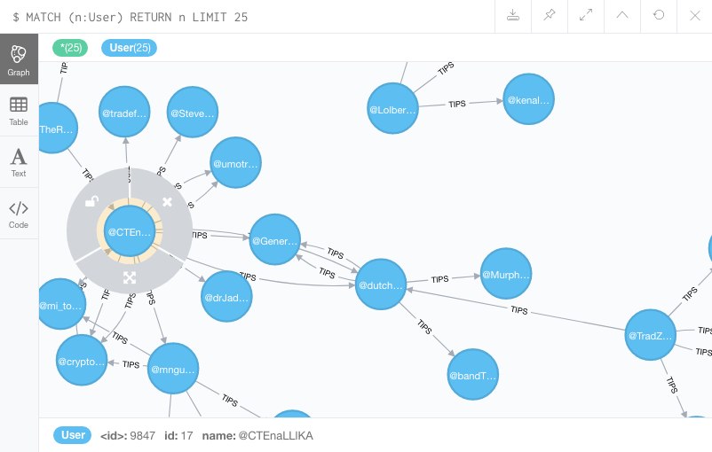
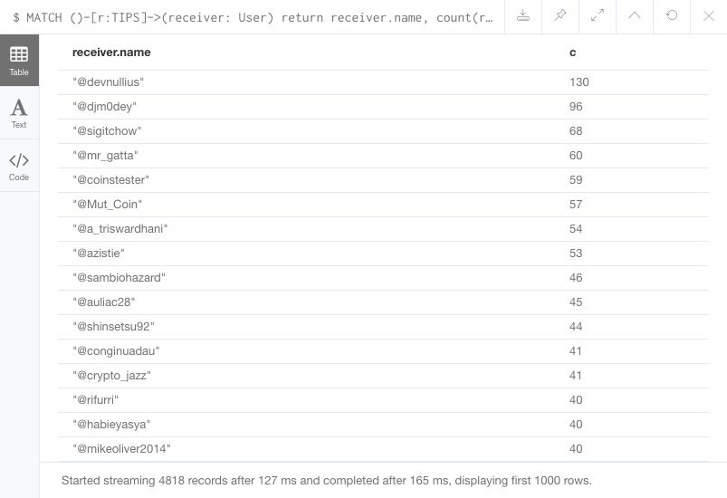
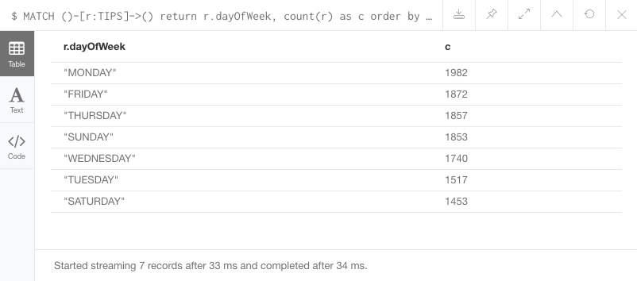
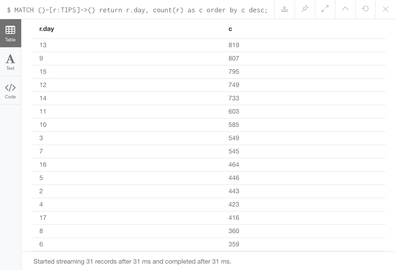
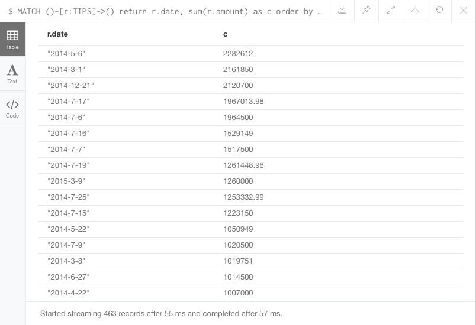

# Whats this?
The crypto currency [Reddcoin](https://www.reddcoin.com/) is a social currency
that makes digital currency easy for the general public. Reddcoin achieves this by integrating a digital
currency platform seamlessly with all major social networks to make the process of sending and receiving money
fun and rewarding for everyone.

One of the best things are the tip bots, for example the [Twitter Bot](https://twitter.com/tipreddcoin)! You can easily tweet something like this:

```
@tipreddcoin tip @unterstein 50 RDD
```

Sending this tweet will transfer 50 Reddcoin from your personal TipBot wallet to the receiver's TipBot wallet.
It makes it incredibly easy to appreciate other user and give feedback to other users.

This is a highly connected and social activity and you can extract this activity to a graph and a graph database, like [Neo4j](https://github.com/neo4j/neo4j).
You work with a flexible network structure of nodes and relationships rather than static tables as you would do in a traditional database. 
With this technology it is possible to model your data as graph, which fits this tipping behavior very well and the graph makes it really easy to 
query your data and don't bother about joins or other complex operations of a SQL-like database. You can learn more on the [Neo4j website](https://neo4j.com/).


# The graph
If you follow the path of code in this repository, you will see that this project basically contains two elements.

1. A program to get all tweets by the Redcoin Twitter bot and stores them locally
2. A program that takes this data and transforms it into a connected graph, where users are nodes and tips are edges.

If you go to your Neo4j browser, you can see a graph similar to this one:



With the Neo4j browser you can easily browse the connections between users, tips and others users. You can pick a starting node
and navigate further from this starting point. But you could also run more advanced queries against this data store.

For example you could query (it's called cypher in the Neo4j world) which users sends the most tips in the data set.

```
MATCH (sender: User)-[r:TIPS]->() return sender.name, count(r) as c order by c desc;
```


Or you could query which users receives the most tips in the data set.

```
MATCH ()-[r:TIPS]->(receiver: User) return receiver.name, count(r) as c order by c desc;
```




Or you could query how much tips are in the data set and what was the total amount of tips over 12.000 tips.

```
MATCH ()-[r:TIPS]->() return count(r)
```


Or you could query how much Reddcoins were tipped overall, which is `63942358 Reddcoins`. Based on the current exchange rate of roughly `0.008` Dollar per Reddcoin, this is over $500.000. This is pretty amazing for a tip bot on twitter! 🎉

```
MATCH ()-[r:TIPS]->() return sum(r.amount)
```


You can see, that `Monday` and `Friday` are the most popular days for tips.

```
MATCH ()-[r:TIPS]->() return r.dayOfWeek, count(r) as c order by c desc;
```




`2014` was by far the most popular year of this tip bot.

```
MATCH ()-[r:TIPS]->() return r.year, count(r) as c order by c desc;
```


`September`, `August` and `October` are the most popular month of tipping. Maybe because it is cold outisde and you can spend more time on Twitter ;-).

```
MATCH ()-[r:TIPS]->() return r.month, count(r) as c order by c desc;
```


```
MATCH ()-[r:TIPS]->() return r.day, count(r) as c order by c desc;
```



```
MATCH ()-[r:TIPS]->() return r.hour, count(r) as c order by c desc;
```


The most popular hours of the day are 15-19 o'clock UTC. This is 16-20 o'clock CET, 7-11 o'clock west coast or 10-14 o'clock east coast.


And the most popular date were `2014-9-15`, `2014-9-13`, `2014-9-14` and `2014-9-11` with over 1000 tips on these 4 days only.

```
MATCH ()-[r:TIPS]->() return r.date, count(r) as c order by c desc;
```


But the most popular date in terms of tip amount are `2014-5-6`, `2014-3-1`, `2014-12-21` with each over `2 Million` Reddcoins tipped per day.

```
MATCH ()-[r:TIPS]->() return r.date, sum(r.amount) as c order by c desc;
```




# Even more is possible
It is possible to do even more advanced and sophisticated cyphers with the Neo4j data store. For example the
research about the panama papers was done with Neo4j, see this [article](https://neo4j.com/blog/analyzing-panama-papers-neo4j/).
In this setup the user searched for patterns, which you can easily model with the cypher query language.


# How to get this started?
Do you want to run your analysis on your own? This is no problem! You can decide if you want to go with the provided data set, that is attached in the folder `data` and import this in your existing Neo4j database, or you can run the twitter importer on your own to have the latest tweets in your analisys.

## Install Neo4j
Go to the [download page](https://neo4j.com/download/) and download a binary suitable for your platform.

### Import the provided data set to your Neo4j instance


### Run the twitter importer on your own
To run the twitter importer, please follow the instructions below 👇

### Build the project
You can simply run `mvn clean package` which builds a jar file which is located in the `target` directory.

### Run the project
To run the twitter importer, you need to run the following command (with your twitter credentials) in this folder:

```
java -cp ./target/reddcoin-graph-0.0.1-SNAPSHOT.jar io.github.unterstein.TwitterImport $customerKey $customerSecret $accessToken $accessTokenSecret
```


To run the Neo4j exporter, you need to run the following command (with your Neo4j credentials) in this folder:

```
java -cp ./target/reddcoin-graph-0.0.1-SNAPSHOT.jar io.github.unterstein.Neo4jExporter $neo4jUri $neo4jUser $neo4jPassword
```
