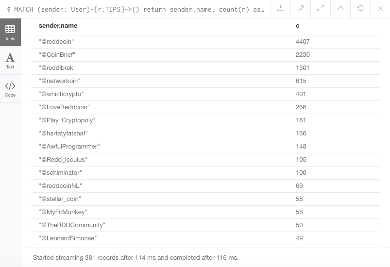
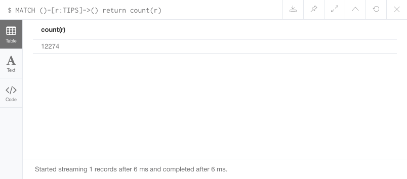

# Whats this?
The crypto currency [Reddcoin](https://www.reddcoin.com/) is a social currency
that makes digital currency easy for the general public. Reddcoin achieves this by integrating a digital
currency platform seamlessly with all major social networks to make the process of sending and receiving money
fun and rewarding for everyone.

I am really enjoying the Reddcoin [Twitter Bot](https://twitter.com/tipreddcoin)! You can easily tweet something like
`@tipreddcoin tip @WhateverUser 50 RDD` to transfer 50 Reddcoin from your personal TipBot wallet to the receiver`s TipBot wallet.
It makes it incredibly easy to appreciate other and g


This is a highly connected and social activity and you can extract this activity to a graph. I am also really enjoying graph databases, like
[Neo4j](https://neo4j.com/). With this technology it is possible to model your data as graph, which fits this tipping behavior very well.

# The graph
If you follow the path of code in this repository, you will see that this project basically contains two elements.

1. A program to get all tweets by the Redcoin Twitter bot and stores them locally
2. A program that takes this data and transforms it into a connected graph, where users are nodes and tips are edges.

You can see an example here:


With the Neo4j UI you can easily browse the connections between users, tips and others users. You can pick a starting node
and navigate further from this starting point. But you could also run more advanced queries against this data store.

For example you could query (it's called cypher in the Neo4j world) which users sends the most tips in the data set:

```
MATCH (sender: User)-[r:TIPS]->() return sender.name, count(r) as c order by c desc;
```




Or you could query which users receives the most tips in the data set:

```
MATCH ()-[r:TIPS]->(receiver: User) return receiver.name, count(r) as c order by c desc;
```


Or you could query how much tips are in the data set and what was the total amount of tips was:

```
MATCH ()-[r:TIPS]->() return count(r)
```



```
MATCH ()-[r:TIPS]->() return sum(r.amount)
```


# Even more is possible
It is possible to do even more advanced and sophisticated cyphers with the Neo4j data store. For example the
research about the panama papers was done with Neo4j, see this [article](https://neo4j.com/blog/analyzing-panama-papers-neo4j/).
In this setup the user searched for patterns, which you can easily model with the cypher query language.

# Limitations
Unfortunately twitter restricted the tweets accessible via the API to 3200 per user. Therefore this graph is restricted to
the latest 3200 interactions (;¬_¬).

# How to get this started?

## Install Neo4j
Go to the [download page](https://neo4j.com/download/) and download a binary suitable for your platform.

## Build the project
You can simply run `mvn clean package` which builds a jar file which is located in the `target` directory.

## Run the project
To run the twitter importer, you need to run the following command (with your twitter credentials) in this folder:

```
java -cp ./target/reddcoin-graph-0.0.1-SNAPSHOT.jar io.github.unterstein.TwitterImport $customerKey $customerSecret $accessToken $accessTokenSecret
```


To run the Neo4j exporter, you need to run the following command (with your Neo4j credentials) in this folder:

```
java -cp ./target/reddcoin-graph-0.0.1-SNAPSHOT.jar io.github.unterstein.Neo4jExporter $neo4jUri $neo4jUser $neo4jPassword
```
